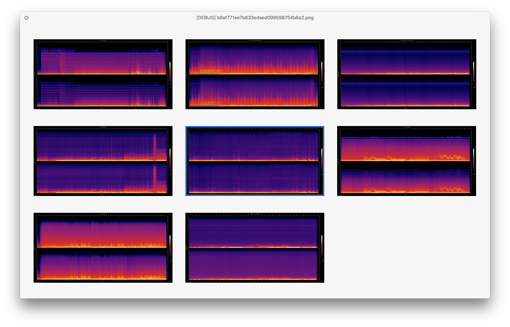

# DropSpec

**DropSpec** is a tool for generating [sox](https://sourceforge.net/projects/sox/) spectograms on macOS.

* **⇩ [Download Latest Version](https://github.com/duckquack/DropSpec/raw/master/DropSpec.app.zip)**

## Screenshot

## Notes

* Running DropSpec requires disabling Gatekeeper by running `sudo spctl --master-disable` in the Terminal.
* Bundled sox will not support mp3 files. To work with mp3s, install sox via MacPorts or Homebrew, and edit the "sox binary" option in preferences.
* Finder integration requires accepting the "access control" dialog in macOS Mojave and later

## Changelog

https://github.com/duckquack/DropSpec/blob/master/CHANGELOG.md