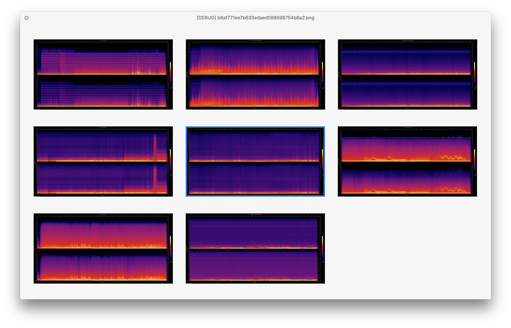
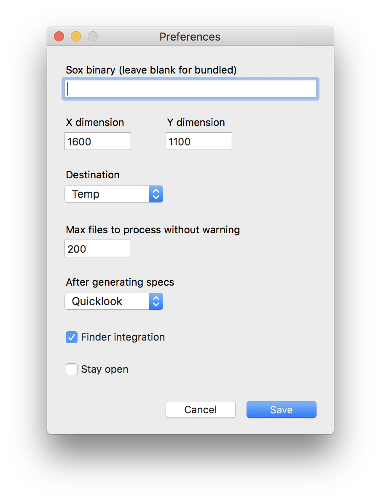

# DropSpec

**DropSpec** is a tool for generating [sox](https://sourceforge.net/projects/sox/) spectograms on macOS.

#### [⇩ Download DropSpec 1.1.2.1](https://www.github.com/duckquack/DropSpec/raw/master/DropSpec.app.zip) ([Changelog](CHANGELOG.md))

## Features

* Scans recursively
* Multithreaded
* Optionally discovers frontmost Finder window path
* Destination option

## Screenshots

## Notes

* Running DropSpec may require disabling Gatekeeper by running `sudo spctl --master-disable` in the Terminal.
* Bundled sox will not support mp3 files. To work with mp3s, install sox via MacPorts or Homebrew, and edit the "sox binary" option in preferences.
* Finder integration requires accepting the "access control" dialog in macOS Mojave and later

## Building from source

Building DropToPTP requires Platypus and Pashua

* https://github.com/sveinbjornt/Platypus
* https://github.com/BlueM/Pashua
